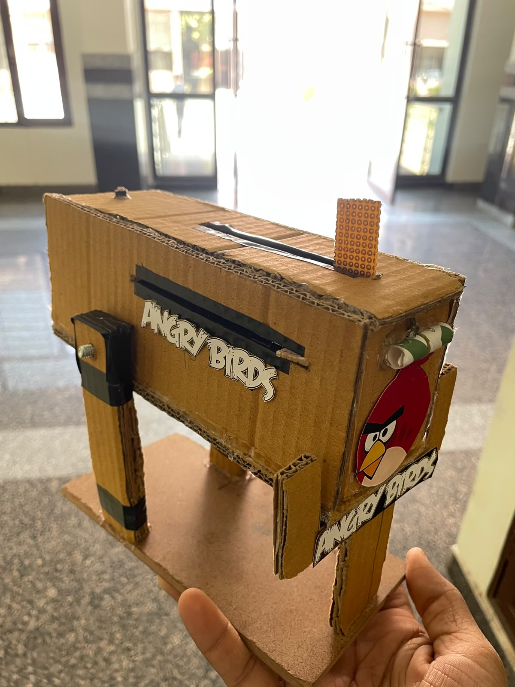
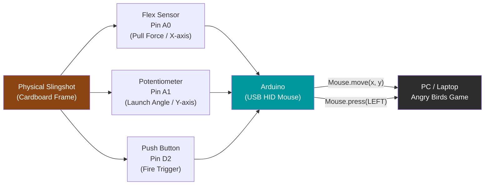

<div align="center">



# 🐦 Angry Birds Slingshot Controller

**A physical Arduino-powered slingshot that lets you play Angry Birds using real-world slingshot mechanics — pull, aim, and fire!**

[](https://www.arduino.cc/)
[](LICENSE)
[](docs/report/project-report.pdf)
[](https://uiet.puchd.ac.in/)

</div>

---

## Overview

The **Angry Birds Slingshot Controller** is a physical game controller built from simple electronics and a cardboard frame that replaces your mouse with an actual slingshot-like device. Instead of dragging your mouse to aim and release birds, you physically **pull back a trigger**, **rotate the launcher arm** to aim, and **press a button** to fire — just like a real slingshot.

| What it does | How |
|---|---|
| Detects pull force | Flex sensor measures bend on pull-trigger |
| Detects launch angle | Potentiometer reads rotation of the launcher arm |
| Fires the bird | Push button simulates mouse left-click |
| Controls the game | Arduino emulates a USB mouse using HID |

This project was built as part of the **Summer Training 2024** program at the **University Institute of Engineering & Technology (UIET), Panjab University, Chandigarh**, combining electronics, embedded programming, and mechanical design into a single creative system.

---

## Demo

<div align="center">

https://github.com/user-attachments/assets/demo.mp4

> 📹 If the video doesn't play above, [click here to download and watch the demo](media/demo/demo.mp4)

</div>

---

## Key Features

- **Real slingshot mechanics** — pull, aim, and fire with physical gestures
- **USB HID mouse emulation** — Arduino acts as a real mouse, no special software needed
- **Angle control** — rotate the launcher to adjust the bird's trajectory in-game
- **Force detection** — flex sensor detects the pull-back force for X-axis control
- **One-button launch** — push button triggers the bird's release with a left mouse click
- **Noise filtering** — moving-average filter smooths the Y-axis potentiometer readings
- **Threshold gating** — X-axis only activates when flex change exceeds 15 units (prevents jitter)
- **DIY frame** — hand-built cardboard housing with all components integrated

---

## How It Works

```
Physical Action         Sensor              Arduino Processing       Game Response
─────────────────────────────────────────────────────────────────────────────────
Pull rubber-band ──→  Flex Sensor (A0)  ──→  X-axis mouse move   ──→  Aim Left
Rotate launcher  ──→  Potentiometer (A1)──→  Y-axis mouse move   ──→  Aim Up/Down
Press button     ──→  Push Button (D2)  ──→  Mouse.press(LEFT)   ──→  Fire Bird!
```

### Step-by-Step Operation

1. **Setup**: Connect the Arduino via USB to your PC. Open Angry Birds on your browser or game client.
2. **Pull the trigger**: Pulling back the rubber-band trigger flexes the flex sensor. When the change exceeds 15 units, the Arduino moves the mouse cursor 30 pixels to the left (simulating slingshot pull).
3. **Aim**: Rotate the launcher arm up or down. The connected potentiometer changes resistance, which the Arduino reads and converts into Y-axis mouse movement (with averaging filter for smoothness).
4. **Fire**: Press the push button. The Arduino sends a `Mouse.press(MOUSE_LEFT)` command — Angry Birds registers a mouse click and releases the bird.
5. **Repeat**: The system resets automatically and is ready for the next bird.

---

## System Architecture



---

## Hardware Components

| Component | Specification | Role |
|-----------|---------------|------|
| Arduino Board | Any with native USB HID (Leonardo / Micro recommended) | Brain — reads sensors, emulates mouse |
| Flex Sensor | Standard 2.2" bend sensor | Measures pull-back force (X-axis) |
| Potentiometer | 10 kΩ rotary | Measures launch angle (Y-axis) |
| Resistor | 320 Ω | Pull-down for flex sensor voltage divider |
| Push Button | Momentary tactile switch | Triggers bird launch (left click) |
| Breadboard | Half-size | Component connections |
| Connecting Wires | Male-to-male jumper wires | Wiring |
| Cardboard Frame | DIY | Physical housing and slingshot mechanism |

> **Important:** The `Mouse` library requires native USB HID support. A standard **Arduino Uno will NOT work**. Use an **Arduino Leonardo**, **Micro**, or **Due** instead.

---

## Circuit Connections

```
Arduino Pin A0 ──────────── Flex Sensor (middle) + 320Ω to GND
Arduino Pin A1 ──────────── Potentiometer Wiper (middle pin)
Arduino Pin D2 ──────────── Push Button → GND  (INPUT_PULLUP)
Arduino 5V     ──────────── Flex Sensor top, Pot left pin
Arduino GND    ──────────── Resistor bottom, Pot right pin, Button
```

See the full wiring guide: [hardware/circuit/wiring-guide.md](hardware/circuit/wiring-guide.md)

---

## 💻 Software Requirements

| Software | Purpose |
|----------|---------|
| [Arduino IDE](https://www.arduino.cc/en/software) | Upload the sketch to Arduino |
| Arduino `Mouse.h` library | Built-in HID mouse emulation (no install needed) |
| Angry Birds | The game to be controlled (PC browser version) |

> The Processing IDE listed in the report is an alternative tool for data visualization but is **not required** for the core functionality of this project.

---

## Getting Started

### 1. Clone the Repository

```bash
git clone https://github.com/YOUR_USERNAME/Angry-Birds-Slingshot-Controller.git
cd Angry-Birds-Slingshot-Controller
```

### 2. Build the Hardware

Follow the wiring guide at [`hardware/circuit/wiring-guide.md`](hardware/circuit/wiring-guide.md).

**Summary:**
- Flex sensor in voltage divider (A0, 320 Ω, 5V, GND)
- Potentiometer wiper → A1
- Push button → D2 (uses `INPUT_PULLUP`, no resistor needed)

### 3. Assemble the Frame

1. Build the cardboard slingshot frame
2. Mount the flex sensor on the pull-trigger mechanism
3. Connect the potentiometer to the rotating launcher arm
4. Mount the push button on an accessible part of the frame
5. House the Arduino and breadboard inside the frame

### 4. Upload the Code

1. Open `src/angry-birds-controller.ino` in **Arduino IDE**
2. Select your board: **Tools → Board → Arduino Leonardo** (or Micro / Due)
3. Select the correct COM port: **Tools → Port → COMX**
4. Click **Upload** (Ctrl+U)

### 5. Play!

1. Open **Angry Birds** on your computer
2. Navigate to a level
3. Pull the trigger → aim with the launcher arm → press the button to fire

---

## Repository Structure

```
Angry-Birds-Slingshot-Controller/
│
├── README.md                          # This file
├── LICENSE                            # MIT License
├── .gitignore                         # Git ignore rules
│
├── src/
│   └── angry-birds-controller.ino    # Main Arduino sketch
│
├── hardware/
│   └── circuit/
│       └── wiring-guide.md           # Detailed wiring instructions
│
├── docs/
│   └── report/
│       └── project-report.pdf        # Full Summer Training report
│
└── media/
    ├── images/
    │   └── project-overview.jpg      # Project photograph
    └── demo/
        └── demo.mp4                  # Demonstration video
```

---

## Code Highlights

### Flex Sensor Threshold Gating
```cpp
// X-axis only activates when flex change exceeds threshold
if (abs(flexDelta) >= FLEX_THRESHOLD) {
    xMovement = -FLEX_MOVE_AMOUNT;  // Move 30 pixels left
}
```

### Y-Axis Moving Average Filter
```cpp
// Smooth potentiometer readings using a 10-sample moving average
yTotal -= yReadings[yReadIndex];
yReadings[yReadIndex] = currentPotValue;
yTotal += currentPotValue;
yReadIndex = (yReadIndex + 1) % Y_AVERAGE_SAMPLES;
yAverage = yTotal / Y_AVERAGE_SAMPLES;
```

### Mouse HID Control
```cpp
Mouse.move(xMovement, yMovement, 0);  // Move cursor
Mouse.press(MOUSE_LEFT);              // Click (fire!)
Mouse.release(MOUSE_LEFT);            // Release
```

---

## Team

| Name | Roll No. |
|------|----------|
| [Mohammed Talha](https://github.com/Drakren) | UE234036 |
| Md Sulaiman Qamar | UE234035 |
| Utkarsh Sharma | UE234070 |
| Anuj Gupta | UE234010 |

**Guide:** Mr. Kuldeep Singh  
**Institute:** University Institute of Engineering & Technology (UIET), Panjab University, Chandigarh — 160014  
**Programme:** B.E. in Electrical and Electronics Engineering  
**Training Period:** 27 May 2024 – 11 June 2024 (15 Days)

---

## References

- [Arduino Reference](https://www.arduino.cc/reference/en/)
- [Mouse Library — Arduino Reference](https://www.arduino.cc/reference/en/language/functions/usb/mouse/)
- [Doing multiple timed things with Arduino: Unleash the millis()!](https://www.youtube.com/watch?v=BYKQ9rk0FEQ)
- [Arduino MASTERCLASS | Full Programming Workshop in 90 Minutes](https://www.youtube.com/watch?v=BLrHTHUjPuw)
- [AutoHotkey: MouseClick at specific position](https://www.youtube.com/watch?v=example)

---

## 📄 License

This project is licensed under the **MIT License** — see the [LICENSE](LICENSE) file for details.

---

<div align="center">

Made with ❤️ by EEE students at **UIET, Panjab University, Chandigarh**

⭐ If you found this project interesting, please give it a star!

</div>
